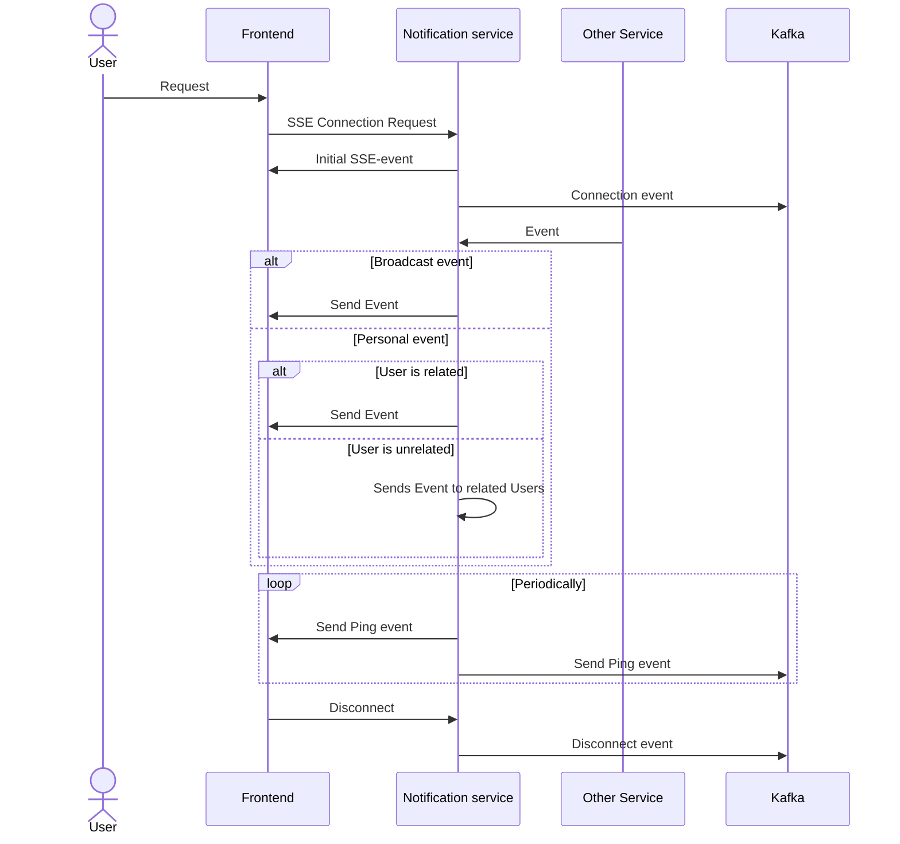

```mermaid
sequenceDiagram
    actor User
    participant Frontend
    participant NS as Notification service
    participant OS as Other Service
    participant Kafka

    User->>Frontend: Request
    Frontend->>NS: SSE Connection Request
    NS->>Frontend: Initial SSE-event
    NS->>Kafka: Connection event

    OS->>NS: Event
    
    alt Broadcast event
        NS->>Frontend: Send Event
    else Personal event
        alt User is related
            NS->>Frontend: Send Event
        else User is unrelated
            NS->>NS: Sends Event to related Users
        end
    end

    loop Periodically
        NS->>Frontend: Send Ping event
        NS->>Kafka: Send Ping event
    end

    Frontend->>NS: Disconnect
    NS->>Kafka: Disconnect event
```