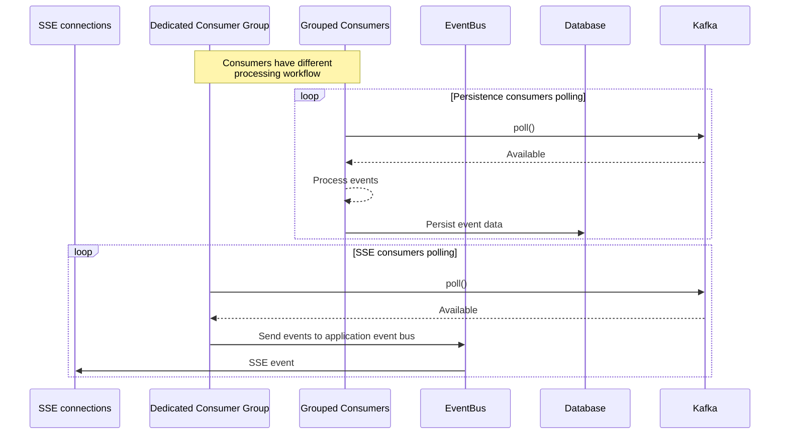

```mermaid
sequenceDiagram
    participant S as SSE connections
    participant C as Dedicated Consumer Group
    participant GC as Grouped Consumers
    participant B as EventBus
    participant D as Database
    participant K as Kafka
    
    Note over GC,C: Consumers have different <br> processing workflow
    
    loop Persistence consumers polling
        GC->>K: poll()
        K-->>GC: Available
        GC-->>GC: Process events
        GC->>D: Persist event data
    end
    
    loop SSE consumers polling
        C->>K: poll()
        K-->>C: Available
        C->>B: Send events to application event bus
        B->>S: SSE event
    end
```