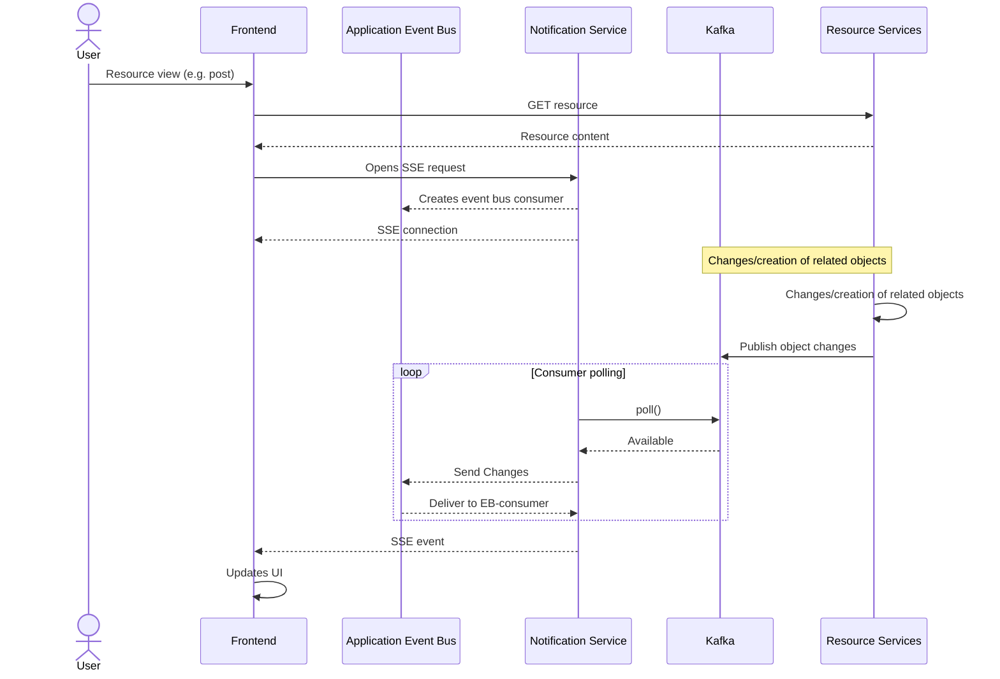

```mermaid
sequenceDiagram
    actor User
    participant FE as Frontend
    participant EB as Application Event Bus
    participant NS as Notification Service
    participant K as Kafka
    participant RS as Resource Services
    
    User->>FE: Resource view (e.g. post)
    FE->>RS: GET resource
    RS-->>FE: Resource content
    
    FE->>NS: Opens SSE request
    NS-->>EB: Creates event bus consumer
    NS-->>FE: SSE connection
    
    Note over RS,K: Changes/creation of related objects
    RS->>RS: Changes/creation of related objects
    RS->>K: Publish object changes
    
    loop Consumer polling
        NS->>K: poll()
        K-->>NS: Available
        NS-->>EB: Send Changes
        EB-->>NS: Deliver to EB-consumer
    end

    NS-->>FE: SSE event
    FE->>FE: Updates UI
```